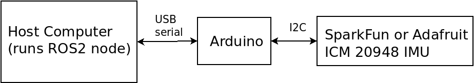

# arduino_imu

ROS2 IMU driver package for Arduino-connected IMUs. This repository
contains an Arduino sketch to read IMU data from a board like the
[Adafruit ICM 20948](https://learn.adafruit.com/adafruit-tdk-invensense-icm-20948-9-dof-imu/arduino)
or the [Sparkfun ICM 20948](https://www.sparkfun.com/products/15335)
and transmit it via USB/serial port to a host computer. For the host
computer side, this repo provides a message parser and ROS2 node to
publish the IMU data.



## Supported platforms

Currently tested on Ubuntu 20.04 under ROS2 Galactic.
Galactic. Continuous integration testing also for Ubuntu 22.04 under
ROS2 Humble.

The Arduino sketch has been tested with a
[Seeed XIAO-nRF52840](https://www.seeedstudio.com/Seeed-XIAO-BLE-Sense-nRF52840-p-5253.html)
(without using the built-in IMU) connected to an
[Adafruit ICM 20948 board](https://learn.adafruit.com/adafruit-tdk-invensense-icm-20948-9-dof-imu/arduino).

## How to install Arduino sketch

Copy the files under ``sketches/arduino_imu`` into your Arduino sketch
directory and install the
[Sparkfun ICM 20948 library](https://www.sparkfun.com/products/15335)
via the IDE's library manager. Compile and flash the sketch.


## How to build the ROS2 node.
Source your ROS2 environment, create a workspace (``~/ws``), clone this repo:
```
pkg=simple_image_recon
mkdir -p ~/${pkg}/src
cd ~/${pkg}/src
git clone https://github.com/berndpfrommer/${pkg}.git
cd ..
colcon build --symlink-install --cmake-args -DCMAKE_BUILD_TYPE=RelWithDebInfo  # (optionally add -DCMAKE_EXPORT_COMPILE_COMMANDS=1)
. install/setup.bash
```

## How to use

Launch the ROS2 node via:
```
ros2 launch arduino_imu node.launch.py
```
Parameters:
- ``device`` path to serial port to which Arduino is connected, e.g. ``/dev/ttyACM0``
- ``baud`` baud rate, *must match the settings in the Arduino sketch(!)* (default: 500000)
- ``queue_size`` ROS2 publisher queue size (default: 10)


## Known issues

The magnetic field data looks weird.

## License

This software is issued under the Apache License Version 2.0.
One small section of the Arduino sketch was copied from the [Sparkfun ICM 20948 library](https://www.sparkfun.com/products/15335).
This part is issued under MIT license. See the Sparkfun library for more details.
